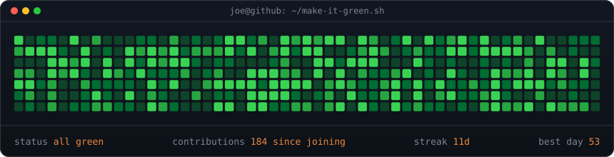

### `joe@github:~$ ./portrait.sh && neofetch`

<table>
  <tr>
    <td valign="top"></td>
    <td valign="top"></td>
  </tr>
</table>

**Joseph Carey (Joe)** · marketing professional, photographer and videographer based in Shropshire, England. 
Studying digital marketing at Aston University. I build my own websites and tools, including [josephcarey.com](https://josephcarey.com) and [Gren](https://gren.app).

[josephcarey.com](https://josephcarey.com) · [LinkedIn](https://www.linkedin.com/in/joecareyuk) · [Instagram](https://www.instagram.com/ajoe) · [gren.app](https://gren.app) · [ORCID](https://orcid.org/0009-0008-4508-7548)

 

### `joe@github:~$ ls ~/projects`

 

### `joe@github:~$ ./make-it-green.sh`

