### `joe@github:~$ ./portrait.sh && neofetch`

<table>
  <tr>
    <td valign="top"></td>
    <td valign="top"></td>
  </tr>
</table>

[josephcarey.com](https://josephcarey.com) · [LinkedIn](https://www.linkedin.com/in/joecareyuk) · [Instagram](https://www.instagram.com/ajoe) · [gren.app](https://gren.app)

 

### `joe@github:~$ ./contributions --last-year`

